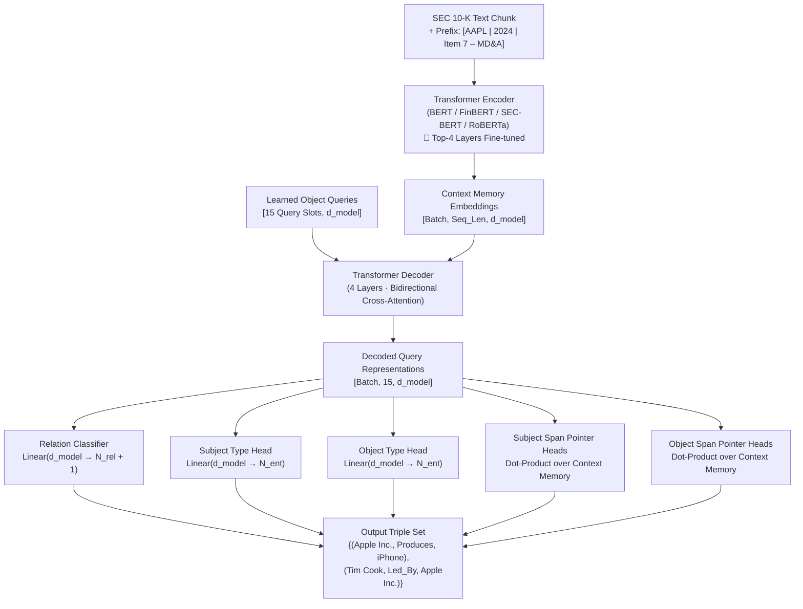
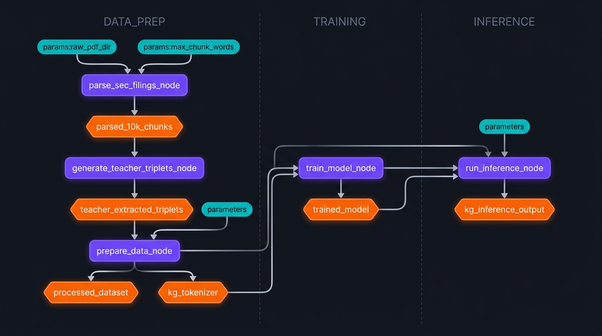

# SEC-BERT → Financial Knowledge Graph Extraction Pipeline

[](https://github.com/astral-sh/ruff)
[](http://mypy-lang.org/)
[](https://pytest.org)
[](https://kedro.org)

An enterprise-grade, end-to-end framework for extracting structured, typed **Financial Knowledge Graph (FKG)** triples from SEC 10-K annual reports. 

Built with [Kedro](https://kedro.org/), PyTorch, HuggingFace Transformers, and [Docling](https://github.com/DS4SD/docling).

---

## Key Highlights

- **$O(1)$ Non-Autoregressive Set Prediction (`DynamicKGExtractor`)**: Adapts the DETR / SPN4RE paradigm to financial relation extraction with bipartite Hungarian matching, producing full sets of triples in a single forward pass without autoregressive decoding bottlenecks.
- **Extractive Pointer Grounding**: Subject and object spans are extracted via dot-product pointer attention over source encoder representations, making entity hallucination architecturally impossible.
- **Document Context & Provenance Ingestion**: Resolves implicit corporate self-references (*"we"*, *"the Company"*, *"the registrant"*) by dynamically prepending a bracketed provenance prefix `[Ticker | Year | Section]` directly into the token stream.
- **Teacher–Student Reflection Distillation**: Uses an offline 3-agent reflection loop (Extractor $\rightarrow$ Critic $\rightarrow$ Refiner) powered by `Qwen2.5-72B-Instruct` via vLLM to synthesize high-precision training labels from S&P 500 10-K filings.
- **Multi-Encoder Benchmarking on Unseen Companies**: Evaluates domain adaptation across `bert-base-uncased`, `ProsusAI/finbert`, `nlpaueb/sec-bert-base`, and `roberta-base` using **company-stratified train/val/test splits** (zero leakage across firms).

---

## Architecture: Set-Prediction with Extractive Pointers



### Extractive Pointer Heads vs. Generative Tokens

Unlike traditional Seq2Seq extractors (REBEL, GenIE) or pure LLM prompting (FinReflectKG), the model never generates token text. Instead:
- $\text{Score}_{\text{start}}(i) = \text{Linear}(q) \cdot h_i^{\text{encoder}}$
- $\text{Score}_{\text{end}}(j) = \text{Linear}(q) \cdot h_j^{\text{encoder}}$

The predicted entity spans are exact slice coordinates $[i, j]$ into the source chunk, ensuring strict compliance with compliance-grade financial reporting standards.

---

## Domain Schema

The schema is defined in [`conf/base/parameters.yml`](conf/base/parameters.yml) and can be extended without altering model source code:

| Class | Labels |
|---|---|
| **Entity Types (7)** | `ORG`, `PERSON`, `PRODUCT`, `SEGMENT`, `FIN_METRIC`, `RISK_FACTOR`, `EVENT` |
| **Relation Types (5)** | `has_metric`, `produces`, `operates_in`, `reports_risk`, `led_by` |

---

## Kedro Pipelines

The project is structured into four independent, reproducible Kedro pipelines:

```
data_prep  ──►  training  ──►  inference
    │
    └──►  benchmark (multi-encoder evaluation)
```



### 1. `data_prep` — Ingestion, Labeling & Tokenization
- `parse_sec_filings_node`: Reads EDGAR SGML filings and PDFs using `docling`, filters to high-signal items (Items 1, 1A, 7, 7A, 8), detects sections, and tags chunks with `{doc_id, chunk_id, ticker, year, section}`.
- `generate_teacher_triplets_node`: Distills gold-standard triples using `Qwen/Qwen2.5-72B-Instruct-GPTQ-Int4` via vLLM on an NVIDIA H100 NVL.
- `prepare_training_data_node`: Injects `[Ticker | Year | Section]` context prefixes, aligns entity spans to token offsets, and generates PyTorch ground-truth tensors.

### 2. `training` — Student Optimization
- Trains `DynamicKGExtractor` using **Hungarian Bipartite Matching Loss** (`scipy.optimize.linear_sum_assignment`).
- Composite loss: $\mathcal{L} = \mathcal{L}_{\text{CE}}^{\text{relation}} + \mathcal{L}_{\text{CE}}^{\text{head\_type}} + \mathcal{L}_{\text{CE}}^{\text{tail\_type}} + \mathcal{L}_{\text{ptr}}^{\text{head\_span}} + \mathcal{L}_{\text{ptr}}^{\text{tail\_span}}$.
- Implements down-weighted `no_relation` class penalty (`eos_coef = 0.1`) and mixed-precision gradient accumulation.

### 3. `inference` — Evaluation & Validation
- Runs single-pass evaluation over validation sets, reporting Exact-Match Triple F1, Precision, and Recall.

### 4. `benchmark` — Cross-Encoder Generalization Study
- Splits teacher data by **company ticker** (70% train, 15% val, 15% test).
- Benchmarks 4 encoder architectures:
  1. `bert-base-uncased`: General language baseline.
  2. `ProsusAI/finbert`: Financial news domain pre-training.
  3. `nlpaueb/sec-bert-base`: Specialized SEC 10-K/10-Q pre-training.
  4. `roberta-base`: Robust general transformer baseline.
- Produces `data/08_reporting/benchmark_results.csv` logging F1, per-relation metrics, parameter counts, and inference latency (ms/sample).

---

## Installation

**Prerequisites**: Python 3.9+, PyTorch with CUDA or Apple Silicon (MPS) support.

```bash
# Clone the repository
git clone https://github.com/LeonardoDiCaterina/bert-kg-extraction-pipeline.git
cd bert-kg-extraction-pipeline

# Install editable package with core dependencies
pip install -e .
```

*Key dependencies*: `kedro`, `torch`, `transformers`, `docling`, `pandas`, `scipy`, `networkx`, `matplotlib`.

> [!TIP]
> **Teacher Extraction (vLLM)**: `generate_teacher_triplets_node` runs `Qwen/Qwen2.5-72B-Instruct-GPTQ-Int4` and requires an NVIDIA GPU with $\ge 80$ GB VRAM (e.g. H100 NVL):
> ```bash
> pip install vllm
> ```
> Student training and inference (`DynamicKGExtractor`) runs efficiently on commodity GPUs or Apple Silicon.

---

## Usage

### Run Pipelines via Kedro

```bash
# 1. Parse filings and generate training data
kedro run --pipeline data_prep

# 2. Train the DynamicKGExtractor student model
kedro run --pipeline training

# 3. Evaluate the trained model
kedro run --pipeline inference

# 4. Run the full Multi-Encoder Benchmark on unseen companies
kedro run --pipeline benchmark

# 5. Run everything end-to-end
kedro run
```

### Standalone Inference & Graph Visualization

Extract financial triples from raw text and display an interactive knowledge graph:

```bash
python predict.py "Apple Inc. operates in the Americas segment and reported record iPhone revenues. Tim Cook leads Apple Inc."
```

Output:
```text
Extracted 3 relational triples:
  • (Apple Inc. [ORG], Produces, iPhone [PRODUCT])
  • (Apple Inc. [ORG], Operates_In, Americas [SEGMENT])
  • (Tim Cook [PERSON], Led_By, Apple Inc. [ORG])

Rendering interactive knowledge graph...
```

### Standalone Evaluation

Evaluate existing checkpoints against test sets:

```bash
python evaluate.py
```

---

## Configuration

All parameters are configured in [`conf/base/parameters.yml`](conf/base/parameters.yml):

```yaml
schema:
  entity_types: ["org", "person", "product", "segment", "fin_metric", "risk_factor", "event"]
  relation_types: ["has_metric", "produces", "operates_in", "reports_risk", "led_by"]

data_prep:
  max_chunk_words: 1500
  max_seq_length: 128
  max_gt_triples: 15

training:
  encoder_model_name: "bert-base-uncased"
  freeze_strategy: "partial"   # Freeze bottom layers, train top 4 layers
  unfrozen_top_layers: 4
  num_queries: 15
  epochs: 10
  batch_size: 4
  gradient_accumulation_steps: 8

split:
  strategy: "company_stratified"  # Strict company-level separation
  train_ratio: 0.70
  val_ratio: 0.15
  test_ratio: 0.15

benchmark:
  models:
    - name: "bert-base-uncased"
    - name: "ProsusAI/finbert"
    - name: "nlpaueb/sec-bert-base"
    - name: "roberta-base"
```

---

## Project Structure

```
bert_kg_mvp/
├── conf/
│   ├── base/
│   │   ├── catalog.yml               # Kedro data catalog
│   │   └── parameters.yml            # Schema, model & benchmark hyperparams
│   └── local/                        # Local developer overrides (gitignored)
├── src/bert_kg_mvp/
│   ├── models/
│   │   ├── architecture_2.py         # DynamicKGExtractor (DETR set prediction)
│   │   ├── bipartite_loss.py         # Hungarian matching loss & span loss
│   │   ├── architecture.py           # Legacy Architecture 1 (Seq2Seq baseline)
│   │   └── logits_processor.py       # Trie-based constrained logits processor
│   ├── pipelines/
│   │   ├── data_prep/                # Parsing (Docling), teacher distillation, prefixing
│   │   ├── training/                 # Student optimization with gradient accumulation
│   │   ├── inference/                # Fast validation and evaluation
│   │   └── benchmark/                # Multi-encoder company-stratified benchmarking
│   ├── utils/
│   │   ├── sec_edgar.py              # SEC header parsing, metadata extraction
│   │   ├── text_processing.py        # Chunk filtering & string sanitization
│   │   ├── tokenization.py           # Entity-to-token span alignment
│   │   └── splitting.py              # Company-stratified dataset partitioner
│   └── pipeline_registry.py          # Kedro pipeline registry
├── tests/                            # Pytest test suite (unit & integration)
├── evaluate.py                       # Standalone evaluation entrypoint
├── predict.py                        # Standalone prediction & graph visualization
├── visualize_graph.py                # Graph rendering utility (NetworkX)
└── pyproject.toml                    # Poetry/pip project specification
```

---

## License

MIT License. See `LICENSE` for details.
