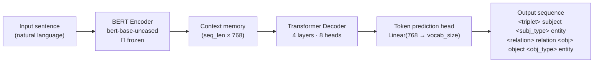

# BERT → Knowledge Graph MVP

A sequence-to-sequence model that extracts structured **(subject, relation, object)** knowledge graph triplets directly from free-text sentences, built with [Kedro](https://kedro.org/) and PyTorch.

**Encoder**: `bert-base-uncased` (frozen) — contextual sentence embeddings  
**Decoder**: 4-layer causal Transformer — generates structured triplet sequences token-by-token  
**Trained on**: [REBEL](https://huggingface.co/datasets/Babelscape/rebel-dataset) — a large-scale relation extraction dataset  

---

## Architecture



### Output Token Schema

The decoder produces a structured tag-delimited sequence:

```
[BOS] <triplet> elon musk <subj_type> entity <relation> founded <obj> spacex <obj_type> entity
      <triplet> spacex <subj_type> entity <relation> located in <obj> california <obj_type> entity [EOS]
```

Each triplet is self-contained within `<triplet>` … `<obj_type>` tags and is parsed with a single regex pattern.

---

## Pipelines

The project uses three Kedro pipelines that can be run independently or chained as a full default pipeline.

```
data_prep  ──►  training  ──►  inference
```

| Pipeline | Input | Output | Description |
|----------|-------|--------|-------------|
| `data_prep` | `parameters` | `processed_dataset`, `kg_tokenizer` | Downloads REBEL, builds encoder/decoder token sequences |
| `training` | `processed_dataset`, `kg_tokenizer` | `trained_model` | Trains the frozen-encoder seq2seq model |
| `inference` | `processed_dataset`, `kg_tokenizer`, `trained_model` | `kg_inference_output` (CSV) | Runs greedy decoding on 20 validation samples, computes F1 |

---

## Installation

**Prerequisites**: Python 3.9+, pip

```bash
# Clone the repo
git clone https://github.com/LeonardoDiCaterina/bert-kg-extraction-pipeline.git
cd bert-kg-extraction-pipeline

# Install all dependencies (editable mode)
pip install -e .
```

This installs: `kedro`, `torch`, `transformers`, `pandas`, `datasets`, `networkx`, `matplotlib`.

> [!NOTE]
> For GPU training, install the CUDA-compatible build of PyTorch separately:
> ```bash
> pip install torch --index-url https://download.pytorch.org/whl/cu121
> ```
> Apple Silicon (MPS) is supported automatically — no extra steps needed.

---

## Usage

### Run the full pipeline (data prep + train + evaluate)

```bash
kedro run
```

### Run individual stages

```bash
kedro run --pipeline data_prep    # Download and tokenise REBEL data
kedro run --pipeline training     # Train the model
kedro run --pipeline inference    # Evaluate on 20 validation samples
```

### Standalone: predict on custom text

```bash
python predict.py "Elon Musk founded SpaceX. SpaceX is located in California."
```

This loads the trained model from the Kedro catalog, runs greedy autoregressive decoding, prints the extracted triplets, and opens an interactive knowledge graph visualisation.

**Example output:**
```
[INPUT]:  Elon Musk founded SpaceX. SpaceX is located in California.
[OUTPUT]: [BOS] <triplet> elon musk <subj_type> entity <relation> founded <obj> spacex <obj_type> entity ...

Drawing Knowledge Graph...
Extracted 2 edges:
  ('elon musk', 'founded', 'spacex')
  ('spacex', 'located in', 'california')
```

### Standalone: evaluate on validation set

```bash
python evaluate.py
```

Runs greedy decoding on the last 20 samples of the processed dataset and reports triplet-level F1, precision, and recall.

### Standalone: visualise a model output string

```bash
python visualize_graph.py "<triplet> space x <subj_type> entity <relation> located in <obj> california <obj_type> entity"
```

---

## Configuration

All hyperparameters live in [`conf/base/parameters.yml`](conf/base/parameters.yml):

| Parameter | Default | Description |
|-----------|---------|-------------|
| `model_name` | `bert-base-uncased` | HuggingFace encoder checkpoint |
| `max_seq_len` | `128` | Max encoder/decoder sequence length (tokens) |
| `d_model` | `768` | Transformer hidden dimension |
| `epochs` | `10` | Training epochs |
| `learning_rate` | `5e-5` | AdamW learning rate |
| `batch_size` | `4` | Micro-batch size |
| `gradient_accumulation_steps` | `8` | Effective batch size = `batch_size × accum_steps` = 32 |
| `dataset_split` | `train[:20000]` | REBEL split to load |
| `max_samples` | `5000` | Max training samples drawn from that split |

Local overrides (e.g. for a quick smoke test) go in `conf/local/parameters.yml` — this file is gitignored.

---

## Data Catalog

Defined in [`conf/base/catalog.yml`](conf/base/catalog.yml):

| Dataset name | Path | Description |
|-------------|------|-------------|
| `raw_texts` | `data/01_raw/input_texts.csv` | Optional hand-crafted input examples |
| `processed_dataset` | `data/03_primary/processed_data.pkl` | Tokenised training tensors |
| `kg_tokenizer` | `data/03_primary/tokenizer.pkl` | Extended BERT tokenizer |
| `trained_model` | `data/06_models/trained_kg_model.pkl` | Serialised trained model |
| `kg_inference_output` | `data/07_model_output/predicted_kgs.csv` | F1 / precision / recall results |

> [!IMPORTANT]
> All `data/` files except `data/01_raw/input_texts.csv` are gitignored. The trained model (~720 MB) must be reproduced locally by running `kedro run`.

---

## Project Structure

```
bert_kg_mvp/
├── conf/
│   ├── base/
│   │   ├── catalog.yml          # Kedro data catalog
│   │   └── parameters.yml       # Hyperparameters
│   └── local/                   # Local overrides (gitignored)
├── data/
│   └── 01_raw/
│       └── input_texts.csv      # Sample input texts (tracked)
├── src/bert_kg_mvp/
│   ├── models/
│   │   ├── architecture.py      # BERTToKnowledgeGraph v1 (unfrozen encoder)
│   │   ├── architecture_2.py    # BERTToKnowledgeGraph v2 (frozen encoder) ← used in training
│   │   └── logits_processor.py  # Experimental: schema-constrained decoding
│   ├── pipelines/
│   │   ├── data_prep/           # Download REBEL, tokenise, build tensors
│   │   ├── training/            # Train seq2seq model with grad accumulation
│   │   └── inference/           # Greedy decoding + F1 evaluation
│   └── pipeline_registry.py     # Registers all pipelines with Kedro
├── evaluate.py                  # Standalone evaluation script
├── predict.py                   # Standalone inference + graph visualisation
├── visualize_graph.py           # NetworkX / Matplotlib KG renderer
└── pyproject.toml               # Project metadata and dependencies
```

---

## Key Design Decisions

- **Frozen BERT encoder** (`architecture_2.py`): freezing the encoder weights dramatically reduces GPU memory usage and training time, while BERT's pre-trained contextual representations are already strong enough for this task.
- **Gradient accumulation**: with a micro-batch of 4 and 8 accumulation steps the effective batch size is 32 — large enough for stable training without needing a high-memory GPU.
- **Tag-delimited decoding**: the output vocabulary is augmented with 7 special structural tokens (`[BOS]`, `[EOS]`, `<triplet>`, `<subj_type>`, `<relation>`, `<obj>`, `<obj_type>`) enabling deterministic regex parsing of model outputs.
- **MPS support**: the training loop includes explicit `torch.mps.empty_cache()` calls and forces the frozen encoder into `eval()` mode to work around the MPS SDPA bug on Apple Silicon.

---

## License

MIT
