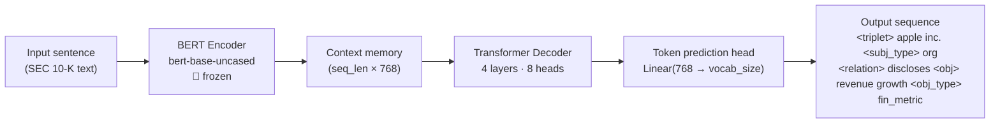

# BERT → Financial Knowledge Graph

A domain-specific **sequence-to-sequence model** that extracts structured financial knowledge graph triplets from SEC 10-K filings, built with [Kedro](https://kedro.org/) and PyTorch.

**Encoder**: `bert-base-uncased` (frozen) — contextual sentence embeddings  
**Decoder**: 4-layer causal Transformer — generates structured triplet sequences token-by-token  
**Trained on**: Teacher-labelled SEC 10-K filings — gold-standard financial triplets generated by a Qwen 2.5-72B model via vLLM  
**Domain**: Financial — follows the **FinReflectKG** closed ontology  

---

## Architecture



### Output Token Schema

The decoder produces a structured tag-delimited sequence with **typed** entities:

```
[BOS] <triplet> apple inc. <subj_type> org <relation> discloses <obj> revenue growth <obj_type> fin_metric
      <triplet> apple inc. <subj_type> org <relation> operates_in <obj> services segment <obj_type> segment [EOS]
```

Each triplet is self-contained within `<triplet>` … `<obj_type>` tags. Entity types are drawn from the FinReflectKG ontology (see below).

---

## FinReflectKG Closed Schema

The teacher model and student decoder both operate within a **closed ontology**:

| | Values |
|---|---|
| **Entity Types** | `ORG`, `PERSON`, `COMP`, `PRODUCT`, `SEGMENT`, `FIN_METRIC`, `RISK_FACTOR`, `EVENT`, `REGULATORY_REQUIREMENT`, `ESG_TOPIC` |
| **Relation Types** | `Has_Stake_In`, `Operates_In`, `Produces`, `Impacts`, `Involved_In`, `Impacted_By`, `Discloses`, `Complies_With`, `Supplies`, `Partners_With` |

---

## Pipelines

The project uses three Kedro pipelines that can be run independently or chained as a full default pipeline.

```
data_prep  ──►  training  ──►  inference
```

### `data_prep` — three-stage pipeline

```
parse_sec_filings_node  ──►  generate_teacher_triplets_node  ──►  prepare_data_node
```

| Node | Input | Output | Description |
|------|-------|--------|-------------|
| `parse_sec_filings_node` | PDF files in `raw_pdf_dir` | `parsed_10k_chunks` | Converts 10-K PDFs to markdown with `docling`; filters to high-signal sections (Items 1, 1A, 7, 7A, 8); removes boilerplate |
| `generate_teacher_triplets_node` | `parsed_10k_chunks` | `teacher_extracted_triplets` | Runs Qwen 2.5-72B (4-bit, via vLLM) in batch to extract typed financial 5-tuples |
| `prepare_data_node` | `teacher_extracted_triplets`, `parameters` | `processed_dataset`, `kg_tokenizer` | Maps teacher JSON output to the encoder/decoder token grammar; builds PyTorch tensors |

### `training`

| Input | Output | Description |
|-------|--------|-------------|
| `processed_dataset`, `kg_tokenizer` | `trained_model` | Trains the frozen-encoder seq2seq model with gradient accumulation |

### `inference`

| Input | Output | Description |
|-------|--------|-------------|
| `processed_dataset`, `kg_tokenizer`, `trained_model` | `kg_inference_output` (CSV) | Greedy decoding on 20 validation samples; computes triplet-level F1, precision, recall |

---

## Installation

**Prerequisites**: Python 3.9+, pip

```bash
# Clone the repo
git clone https://github.com/LeonardoDiCaterina/bert-kg-extraction-pipeline.git
cd bert-kg-extraction-pipeline

# Install all dependencies (editable mode)
pip install -e .
```

This installs: `kedro`, `torch`, `transformers`, `pandas`, `docling`, `networkx`, `matplotlib`.

> [!NOTE]
> **GPU requirements for teacher extraction**: `generate_teacher_triplets_node` loads Qwen 2.5-72B (GPTQ Int4) via vLLM and requires an NVIDIA H100 (80 GB VRAM) or equivalent. Install vLLM separately:
> ```bash
> pip install vllm
> ```
> The BERT student training step runs on any CUDA GPU, or Apple Silicon (MPS) — no extra steps needed.

> [!NOTE]
> For GPU student training, install the CUDA-compatible build of PyTorch separately:
> ```bash
> pip install torch --index-url https://download.pytorch.org/whl/cu121
> ```

---

## Usage

### Prepare the data

Place your SEC 10-K PDF files in `data/01_raw/` (configured by `raw_pdf_dir`), then run:

```bash
kedro run --pipeline data_prep
```

Or run individual stages:

```bash
kedro run --to-nodes="parse_sec_filings_node"          # Parse PDFs → chunks
kedro run --to-nodes="generate_teacher_triplets_node"  # Teacher extraction (requires H100)
kedro run --to-nodes="prepare_data_node"               # Build training tensors
```

### Train and evaluate

```bash
kedro run --pipeline training    # Train the student model
kedro run --pipeline inference   # Evaluate on 20 validation samples
```

### Run the full pipeline

```bash
kedro run
```

### Standalone: predict on custom text

```bash
python predict.py "Apple Inc. disclosed strong revenue growth driven by its Services segment."
```

This loads the trained model from the Kedro catalog, runs greedy autoregressive decoding, prints the extracted triplets, and opens an interactive knowledge graph visualisation.

**Example output:**
```
[INPUT]:  Apple Inc. disclosed strong revenue growth driven by its Services segment.
[OUTPUT]: [BOS] <triplet> apple inc. <subj_type> org <relation> discloses <obj> revenue growth <obj_type> fin_metric ...

Drawing Knowledge Graph...
Extracted 2 edges:
  ('apple inc.', 'discloses', 'revenue growth')
  ('apple inc.', 'operates_in', 'services segment')
```

### Standalone: evaluate on validation set

```bash
python evaluate.py
```

Runs greedy decoding on the last 20 samples of the processed dataset and reports triplet-level F1, precision, and recall.

### Standalone: visualise a model output string

```bash
python visualize_graph.py "<triplet> apple inc. <subj_type> org <relation> discloses <obj> revenue growth <obj_type> fin_metric"
```

---

## Configuration

All hyperparameters live in [`conf/base/parameters.yml`](conf/base/parameters.yml):

| Parameter | Default | Description |
|-----------|---------|-------------|
| `raw_pdf_dir` | `data/01_raw` | Directory containing SEC 10-K PDF files |
| `max_chunk_words` | `1500` | Maximum words per text chunk during PDF parsing |
| `model_name` | `bert-base-uncased` | HuggingFace encoder checkpoint |
| `max_seq_len` | `128` | Max encoder/decoder sequence length (tokens) |
| `d_model` | `768` | Transformer hidden dimension |
| `epochs` | `10` | Training epochs |
| `learning_rate` | `5e-5` | AdamW learning rate |
| `batch_size` | `4` | Micro-batch size |
| `gradient_accumulation_steps` | `8` | Effective batch size = `batch_size × accum_steps` = 32 |
| `max_samples` | `5000` | Max training samples drawn from teacher-extracted data |

Local overrides (e.g. for a quick smoke test) go in `conf/local/parameters.yml` — this file is gitignored.

---

## Data Catalog

Defined in [`conf/base/catalog.yml`](conf/base/catalog.yml):

| Dataset name | Path | Description |
|-------------|------|-------------|
| `raw_texts` | `data/01_raw/input_texts.csv` | Optional hand-crafted input examples |
| `parsed_10k_chunks` | `data/02_intermediate/parsed_10k_chunks.csv` | Section-filtered markdown chunks from 10-K PDFs |
| `teacher_extracted_triplets` | `data/02_intermediate/teacher_extracted_triplets.csv` | Typed financial 5-tuples from Qwen 72B teacher |
| `processed_dataset` | `data/03_primary/processed_data.pkl` | Tokenised training tensors |
| `kg_tokenizer` | `data/03_primary/tokenizer.pkl` | Extended BERT tokenizer |
| `trained_model` | `data/06_models/trained_kg_model.pkl` | Serialised trained model |
| `kg_inference_output` | `data/07_model_output/predicted_kgs.csv` | F1 / precision / recall results |

> [!IMPORTANT]
> All `data/` files except `data/01_raw/input_texts.csv` are gitignored. Intermediate CSVs and the trained model must be reproduced locally by running `kedro run`.

---

## Project Structure

```
bert_kg_mvp/
├── conf/
│   ├── base/
│   │   ├── catalog.yml          # Kedro data catalog
│   │   └── parameters.yml       # Hyperparameters
│   └── local/                   # Local overrides (gitignored)
├── data/
│   ├── 01_raw/
│   │   └── input_texts.csv      # Sample input texts (tracked)
│   └── 02_intermediate/         # Generated — gitignored
│       ├── parsed_10k_chunks.csv
│       └── teacher_extracted_triplets.csv
├── src/bert_kg_mvp/
│   ├── models/
│   │   ├── architecture.py      # BERTToKnowledgeGraph v1 (unfrozen encoder)
│   │   ├── architecture_2.py    # BERTToKnowledgeGraph v2 (frozen encoder) ← used in training
│   │   └── logits_processor.py  # Experimental: schema-constrained decoding
│   ├── pipelines/
│   │   ├── data_prep/
│   │   │   ├── nodes.py         # parse_sec_filings, prepare_training_data
│   │   │   ├── teacher_node.py  # generate_teacher_triplets (Qwen 72B via vLLM)
│   │   │   └── pipeline.py      # 3-node data prep pipeline
│   │   ├── training/            # Train seq2seq model with grad accumulation
│   │   └── inference/           # Greedy decoding + F1 evaluation
│   └── pipeline_registry.py     # Registers all pipelines with Kedro
├── evaluate.py                  # Standalone evaluation script
├── predict.py                   # Standalone inference + graph visualisation
├── visualize_graph.py           # NetworkX / Matplotlib KG renderer
└── pyproject.toml               # Project metadata and dependencies
```

---

## Key Design Decisions

- **Teacher–Student pipeline**: A Qwen 2.5-72B model (GPTQ Int4, via vLLM) acts as teacher to generate high-quality, typed financial triplets from raw SEC filings. The smaller BERT-decoder student is then trained on this gold-standard dataset, combining LLM reasoning with efficient inference.
- **FinReflectKG closed schema**: Constraining both teacher prompting and student decoding to a fixed financial ontology reduces hallucination and makes outputs deterministic and parseable.
- **Section-aware PDF parsing**: `parse_sec_filings` focuses on high-signal 10-K sections (Items 1, 1A, 7, 7A, 8) and filters out boilerplate (cover pages, checkboxes, chunks < 50 words).
- **Frozen BERT encoder** (`architecture_2.py`): freezing encoder weights dramatically reduces GPU memory and training time while retaining BERT's strong contextual representations.
- **Gradient accumulation**: with a micro-batch of 4 and 8 accumulation steps the effective batch size is 32 — large enough for stable training without a high-memory GPU.
- **Tag-delimited decoding**: the output vocabulary is augmented with 7 special structural tokens (`[BOS]`, `[EOS]`, `<triplet>`, `<subj_type>`, `<relation>`, `<obj>`, `<obj_type>`) enabling deterministic regex parsing of model outputs.
- **MPS support**: the training loop includes explicit `torch.mps.empty_cache()` calls and forces the frozen encoder into `eval()` mode to work around the MPS SDPA bug on Apple Silicon.

---

MIT
